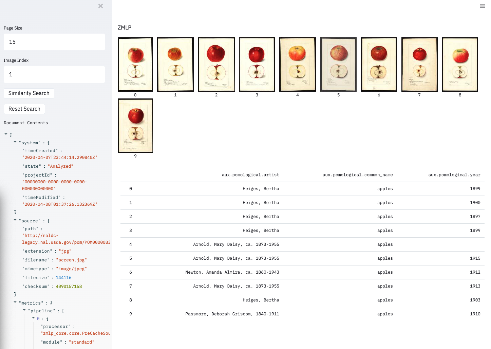

# Sandbox

This is a Streamlit sandbox. Streamlit (https://www.streamlit.io/) is a framework that allows for quick development of data apps.

A couple of different scripts are included.

## Getting Started

### Prerequisites

- Make sure you can run `docker-compose up` on the main zmlp repo directory

### Build the docker container

```
docker build . -t 'zmlp/sandbox'
```

### Run

From the main zmlp repo folder:

```
docker-compose up -d
docker-compose -f docker-compose.yml -f applications/sandbox/docker-compose.yml up sandbox
```

or two run the server, Workbench and Sandbox all at once, run

```
docker-compose -f docker-compose.yml -f applications/workbench/docker-compose.yml -f applications/sandbox/docker-compose.yml up --force-recreate -d
```


Then navigate to http://localhost:8501

To add a new one, place the Python file in the sandbox/scripts directory. The entry point for Sandbox, sandbox.py, will detect scripts in that directory and allow
the user to select which one to run.

It is not necessary to restart the docker image when you edit an app, which makes it very easy to
develop. Once you save a change to this file, the live Streamlit app will show a refresh button.


